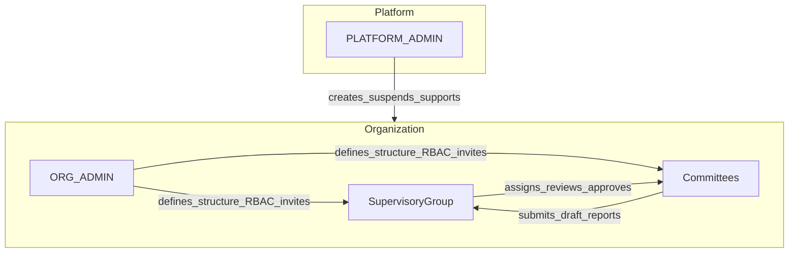
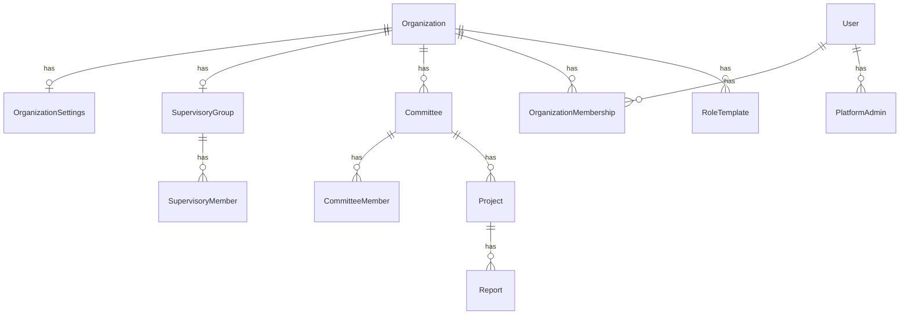
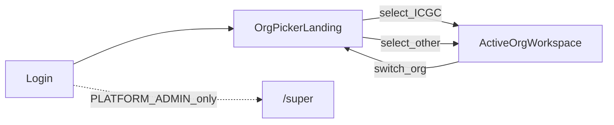

# Steward Product Vision & Upgrade Map

**Status:** Canonical product direction  
**Last updated:** 2026-07-17  
**Supersedes:** [prd.md](../prd.md) for product scope and domain model (PRD retained for historical church-demo context and UX/touch rules)

This document is the single main for Steward upgrades. Implementation phases follow the map below; revise this file when product decisions change.

---

## 1. Thesis & non-goals

### Thesis

**Steward** is a governance operating system for groups that create working committees: companies, government bodies, alumni associations, religious organizations, NGOs, and similar.

It is not a generic project-management clone. The differentiator is:

> **Structure → mandate → work → draft report → supervisory approval → final report → close.**

Committee work tools (tasks, schedule, minutes, documents) support that loop; they are not the product’s identity.

The current codebase is a mature **single-tenant church demo**. Keep its committee workspace strengths; replace the hardcoded Presbytery/charter spine with a multi-tenant, configurable organization model.

### Non-goals (near term)

- Competing with full general-purpose PM suites (Asana, Jira, etc.) on feature breadth
- Nested subcommittees (v1 is flat)
- Multiple supervisory bodies per org (v1 is one; schema may allow more later)
- Full freeform organigram canvas (v1 is a tree builder)
- Billing / marketplace (out of scope until platform Super is stable)

---

## 2. Naming glossary

| Term | Code / role | Meaning | Surface |
|------|-------------|---------|---------|
| **Super** | `PLATFORM_ADMIN` | Platform operator across all tenants | `/super` |
| **Org Admin** | `ORG_ADMIN` | Org tech owner: structure, invites, RBAC, ownership transfer | Org admin UI |
| **Supervisory group** | `SupervisoryGroup` | Governing body (Presbytery, Cabinet, Board, Council…) — **label configurable per org** | Main app |
| **Supervisory head** | member with `isHead` / head title | High visibility; optional approve; not always a required stack step | Main app |
| **Supervisory secretary** | supervisory title (e.g. GS) | Day-to-day admin, document funnel, agenda owner — **label via template**, not a hardcoded enum | Main app |
| **Committee** | `Committee` | Working group node with configurable titles | Committee workspace |
| **Organization** | `Organization` | Tenant | Org picker + scoped workspace |
| **Approval stack** | org-configured ordered steps | Who must review before work is officially accepted (e.g. Chair → Secretary) | Admin + workflows |
| **My work** | personal hub | Cross-committee tasks, assignments, projects, meetings for the signed-in user | Org shell |
| **Schedule item** | `Event` with `kind` | Meeting or event; minutes live only on meetings | Schedule |

**Rules:**

- “Super” in product language means **platform only**.
- Org-level tech admin is always **Org Admin**, never “super admin”.
- Church titles (General Overseer, General Secretary) are **Template A labels**, never core enums.

### Rename map from current codebase

| Today | Target |
|-------|--------|
| `SUPER_ADMIN` / `SYSTEM_ADMIN` | **Org Admin** (`ORG_ADMIN`; optional narrower `ORG_TECH` later) |
| `CHURCH_EXECUTIVE` + `PresbyteryGroup` / `PresbyteryMember` | **Supervisory** membership / group |
| `AssignmentSource.PRESBYTERY` | `SUPERVISORY` or `DIRECTIVE` |
| Global charter letters a–s | Per-org free-form committees (no global charter law) |
| Singleton `AppSettings` | Per-organization settings |

---

## 3. Actor model & capabilities

### Three people groups

1. **Platform (Super)** — behind the scenes across all tenants (`/super`).
2. **Supervisory group** — assigns projects, reviews draft reports, approves to final, closes projects. Has a head.
3. **Committees** — do the work; may self-initiate projects and submit reports. Org Admin defines committee structure and titles.

Supervisory can see everything at committee level. Org policies control whether ordinary members may see across all committees, and whether supervisory may assign members to committees.

### Org Admin capabilities

- Create/edit org structure (supervisory group + committees) via visual tree builder
- Define role titles per committee / templates
- Invite users onto nodes with a role
- Configure RBAC / visibility policies
- Transfer Org Admin to another member
- Not required to be Supervisory Head (roles separable)

### Platform Super (`/super`) — v1 scope

Small ops console, same Next.js deploy, hard-gated:

- List / search organizations
- Create organization (sets initial Org Admin invite or owner)
- Suspend / reactivate organization
- Transfer org ownership (break-glass)
- Manage platform admin list
- Audited support “view as Org Admin” — Phase 1b+ if needed

**Out of scope for `/super`:** organigram, committee work, org RBAC matrix.

Auth: require `PlatformAdmin` on every `/super` page and `/api/super/*`. Org `ORG_ADMIN` does **not** grant `/super`.

---

## 4. Domain model

### Core entities (conceptual)

| Entity | Role |
|--------|------|
| `Organization` | Tenant; `status` ACTIVE \| SUSPENDED; display labels for supervisory/committee terms |
| `OrganizationMembership` | User in org with org-level role (`ORG_ADMIN`, participant, etc.) |
| `PlatformAdmin` | Who may access `/super` |
| `SupervisoryGroup` + `SupervisoryMember` (+ `isHead`) | Rename of Presbytery* |
| `Committee` | Free-form per org (no global `charterLetter` uniqueness across tenants) |
| `RoleTemplate` / committee titles | Configurable strings + bound capabilities |
| `Project` | From supervisory assignment **or** committee-initiated |
| `Report` | Draft/final lifecycle linked to project (and optionally assignment) |

Existing work objects stay: Task, Event, Meeting, Document, Assignment (source renamed as above).

**Every tenant-scoped row gets `organizationId`.**

---

## 5. Governance loop (differentiator)

1. Supervisory assigns project/assignment to a committee **or** committee initiates project (per policy).
2. Committee executes via tasks / schedule / minutes.
3. Committee submits **draft report**.
4. Supervisory reviews → return or approve as **final**.
5. On final approval, project is **closed** (or marked complete and closed in the same action).

Supervisory overview dashboard = today’s Presbytery / overall dashboard, generalized.

Report states: `DRAFT` → `RETURNED` / `FINAL`. Approving FINAL closes (or marks closable) the linked project.

---

## 6. Post-login: organization picker landing

After authentication, users do **not** drop straight into a committee dashboard. They land on an **organization home** (e.g. `/orgs` or `/`):

- Cards/list of every organization they belong to
- For each org: **display name** + **roles they hold there** (Org Admin, Supervisory head/member, committee titles summarized)
- Primary action: **Enter** → sets `activeOrganizationId` and opens the org workspace

### UX rules

| Rule | Behavior |
|------|----------|
| One membership only | Still show the picker (v1 always shows picker; no auto-enter preference yet) |
| Suspended org | Visible as disabled with reason; not enterable |
| Platform admins | `/super` is a separate entry — not mixed into the org card list as a fake org |
| Switch org | From inside an org shell, return to picker (or switch active org) without logging out |

Session shape: `user + activeOrganizationId` (unset until the user picks an org).

---

## 7. Structure builder & RBAC intent

### Structure builder (v1)

- **Tree builder** (not a freeform organigram canvas): Supervisory root → committees → role slots
- Click a node → invite people to register into that role
- Org Admin can mutate structure after go-live

### RBAC console (later phase)

- Capability matrix bound to org roles, supervisory membership, and committee titles
- Policies examples:
  - Cross-committee visibility for ordinary members
  - Who may self-initiate projects
  - `requireOversightOnSelfInitiated` for committee-started work
- Prefer permissions attached to **titles/templates**, not hardcoded English words like “Chair”

---

## 8. Locked defaults

| Decision | Default |
|----------|---------|
| User ↔ org | Users may belong to **many** orgs; session has one **active organization** |
| Post-login entry | **Org picker landing** — list orgs + roles, then enter |
| Demo migration target | Existing church demo → organization **`ICGC`** |
| Committee nesting | **Flat** in v1 |
| Supervisory bodies per org | **One** in v1; schema may allow more later |
| Project oversight | Assigned work always requires supervisory review; self-initiated follows `requireOversightOnSelfInitiated` |
| Org Admin vs creator | Creator is initial Org Admin; role is **transferable** |
| Platform entry | `/super` (same app, separate gate) |
| Structure builder v1 | Tree builder; click node → invite |
| Reports | First-class `Report`: DRAFT → RETURNED / FINAL; approve closes project |
| Nav chrome | Shell-first; committee sections in sidebar only (≤5); minutes under Schedule meetings |
| Approval stack | Configurable ordered steps per org |
| AI | Suggest → accept; never mutates governance state alone |

---

## 9. Template A: church demo → organization ICGC

The current single-tenant UnityCommit church demo is **Template A**, not the product identity.

| Field | Value |
|-------|--------|
| Organization name | **ICGC** |
| Source | Existing seeded committees, Presbytery roster, users, tasks, projects, etc. |
| Supervisory display label | Keep “Presbytery” (or current copy) as ICGC’s configured label |
| Existing users | `OrganizationMembership` on ICGC; roles mapped from today’s `UserRole` / committee / Presbytery memberships |

**Phase 1 exit criteria:** After migrate, a demo user logs in, sees **ICGC** on the org picker with their roles, and entering ICGC preserves prior committee data and access patterns.

A fuller extract of church-specific PRD content may later live at `docs/templates/church.md` (Phase 2). Until then, treat [prd.md](../prd.md) and [src/lib/committees.ts](../src/lib/committees.ts) as the Template A reference.

---

## 10. What we keep vs change

### Keep (reuse)

- Tasks, projects, assignment status machine
- Minutes / schedule / RSVP
- Invites / OTP
- Permission *shape* (global + scoped title + supervisory head)
- Mobile-first committee UI, attention / KPI patterns

### Generalize

- Presbytery* → Supervisory*
- Church copy / labels
- Charter a–s as product law
- Cookie / session → active org
- `AppSettings` → per org

### Add

- Organization tenancy
- `/super`
- Org Admin rename
- Org picker landing
- Structure builder
- Configurable titles + RBAC UI
- Report entity

---

## 11. Key code anchors (today)

| Area | Path |
|------|------|
| Schema | [prisma/schema.prisma](../prisma/schema.prisma) |
| Roles / helpers | [src/lib/types.ts](../src/lib/types.ts), [src/lib/auth.ts](../src/lib/auth.ts) |
| Charter lock | [src/lib/committees.ts](../src/lib/committees.ts) |
| Client permissions | [src/lib/permissions-client.ts](../src/lib/permissions-client.ts) |
| Admin UI | [src/app/admin](../src/app/admin) |
| Presbytery API | `src/app/api/presbytery` |
| Seed | [prisma/seed.ts](../prisma/seed.ts) |
| UX principles (still useful) | [docs/ui-principles.md](./ui-principles.md) |
| Historical PRD / Template A notes | [prd.md](../prd.md) |

---

## 12. Phased upgrade map

### Phase 0 — Canonical documentation (this document)

- [x] Write `docs/PRODUCT.md`
- Point `prd.md` to this file as superseded for product direction
- Note Template A / ICGC (full `docs/templates/church.md` extract can wait for Phase 2)

**Exit:** Team treats this file as the product main.

### Phase 1 — Multi-tenant spine + Super + org picker

- [x] Organization tenancy, ICGC migration, org picker, `/super`, Org Admin rename

### Phase 2 — Neutral domain language

- [x] SupervisoryGroup rename, org labels, data-driven committees

### Phase 3 — Structure builder + invites-on-nodes

- [x] Tree UI at `/admin/structure`

### Phase 4 — RBAC console

- [x] Policies + role capability matrix at `/admin/rbac`

### Phase 5 — Report governance loop

- [x] Reports at `/reports` (draft → submit → approve/return → project complete)

### Phase 6 — Templates & onboarding polish

- [x] Org templates via `/super` create (blank / church / board)

### Phase 7 — Governance flexibility (ICGC discovery, org-agnostic)

Discovery from Template A (ICGC) interviews; product stays multi-tenant and label-configurable.

#### 7a. Supervisory titles + visibility

- Supervisory members have **titles** (role template key / custom label), not only `isHead`.
- **Visibility ≠ required approval:** a head title may `canViewAll` + optional approve without being a mandatory stack step.
- ICGC seed: “General Overseer” (head, full visibility, optional approve) and “General Secretary” (admin funnel).

#### 7b. Configurable approval stacks

- Org Admin defines an ordered **approval stack** (JSON steps bound to committee titles or supervisory titles).
- Assignment escalate and report review walk the stack.
- AI is never a stack step.

#### 7c. Assignment cascade

1. Supervisory directive → **person** and/or committee.
2. Accountable owner may create a **child** assignment scoped to a committee.
3. Owner escalates upward → approval stack.
4. Ready items can be **tabled** as agenda items on a supervisory meeting.

#### 7d. Schedule + minutes

- One **Schedule** surface: `MEETING` | `EVENT`, with format (in-person / virtual / hybrid), location / join URL, agenda, attachments.
- **Minutes are not a top-level area** — they live on Schedule meetings only.
- Upcoming / previous lists by date.

#### 7e. Durable shell-first UI

| Layer | Pattern | Contents |
|-------|---------|----------|
| Org shell | Sidebar + mobile dock | Home, My work, committees, Reports, Messages, Documents, Admin |
| Committee | ≤5 sections **in the shell only** | Overview, Board, Projects, Assignments, Schedule |
| Nested | Detail pages | Meeting → minutes; Document Studio; AI panels |

- Remove horizontal committee tab strip as primary IA (no second sitemap).
- Never add Messages, Documents, My work, or AI as committee peers.
- Growth rule: nest or promote to shell — never a sixth committee peer.

#### 7f. My work, messaging, documents

- **My work:** member-centric inbox across tasks, assignments, projects, meetings.
- **Messages:** member↔member and committee threads (separate from entity Comments).
- **Documents:** library + comments on `LIBRARY_DOCUMENT` / attachments; GS “funnel” = stack routing, not a separate DMS.

#### 7g. AI assists (suggest → accept)

- Never auto-approve, escalate, or send.
- Tenant-scoped prompts/retrieval only.
- Priority: (1) project → tasks with CPM-style dependencies; (2) Document Studio review AI; then report draft, approval brief, agenda suggest, minutes draft, assignment scope.

**Exit:** PRODUCT.md encodes the above; schema/UI implement Phase 7 slices.

---

## 13. Locked defaults (Phase 7 additions)

| Decision | Default |
|----------|---------|
| Supervisory dual roles | Titles + capabilities; ICGC GO/GS via seed labels only |
| Approval order | Admin-configurable stack per org |
| Assignment targets | Person and/or committee; referral chain for cascade |
| Minutes | Nested under Schedule meetings only |
| Navigation | Shell-first; ≤5 committee sections; no horizontal tab sitemap |
| AI | Suggest → human accept; never an approval-stack step |
| Messaging vs comments | Threads for people/groups; Comments on work entities |

---

## 14. Document maintenance

- Product decisions land here first, then in schema/UI.
- Do not reintroduce “Super Admin” for org-level tech roles.
- Church-specific wording belongs in org labels / Template A, not in core enums.
