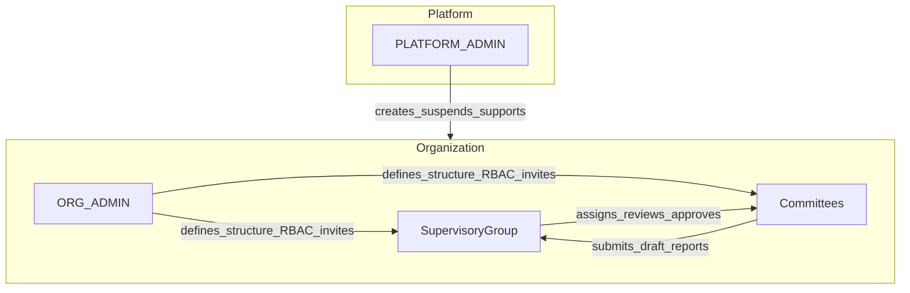
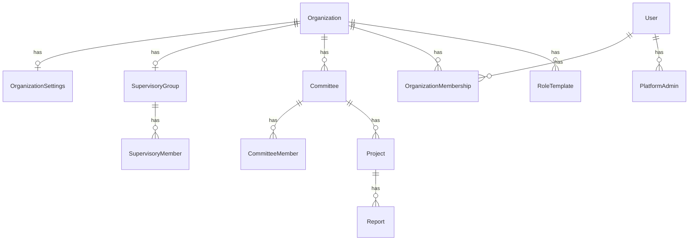
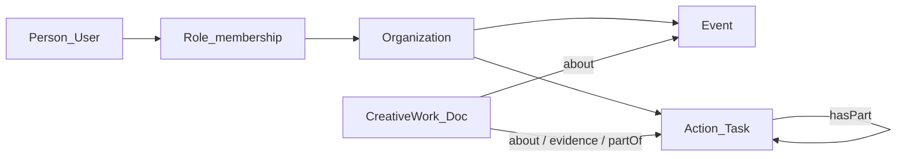
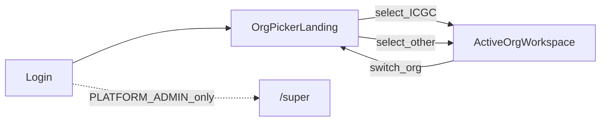

# Steward Product Vision & Upgrade Map

**Status:** Canonical product direction  
**Last updated:** 2026-07-27  
**Supersedes:** [prd.md](../prd.md) for product scope and domain model (PRD retained for historical church-demo context and UX/touch rules)

This document is the single main for Steward upgrades. Implementation phases follow the map below; revise this file when product decisions change.

> **Demo-first simplification (2026-07):** Nav, Home, and the work object model are redefined in [SIMPLIFICATION.md](./SIMPLIFICATION.md). That doc **supersedes** conflicting Phase 7e/7f guidance (shell peers, My work, Assignment cascade as product path). Prefer clean breaks over dual-write; see the breaking-change policy there.

---

## 1. Thesis & non-goals

### Thesis

**Steward** is a governance operating system for groups that create working committees: companies, government bodies, alumni associations, religious organizations, NGOs, and similar.

It is not a generic project-management clone. The differentiator is:

> **Structure → mandate → work → review → close.**

Committee work tools (tasks, events, minutes, documents) support that loop; they are not the product’s identity. **Task** is the only first-class work object (see [SIMPLIFICATION.md](./SIMPLIFICATION.md)).

The current codebase is a mature **single-tenant church demo**. Keep its committee workspace strengths; replace the hardcoded Presbytery/charter spine with a multi-tenant, configurable organization model.

### Non-goals (near term)

- Competing with full general-purpose PM suites (Asana, Jira, etc.) on feature breadth
- Nested subcommittees (v1 is flat)
- Multiple supervisory bodies per org (v1 is one; schema may allow more later)
- Full freeform organigram canvas (v1 is a tree builder)
- Billing / marketplace (out of scope until platform Super is stable)

---

## 2. Naming glossary

| Term | Code / role | Meaning | Surface |
|------|-------------|---------|---------|
| **Super** | `PLATFORM_ADMIN` | Platform operator across all tenants | `/super` |
| **Org Admin** | `ORG_ADMIN` | Org tech owner: structure, invites, RBAC, ownership transfer | Org admin UI |
| **Supervisory group** | `SupervisoryGroup` | Governing body (Presbytery, Cabinet, Board, Council…) — **label configurable per org** | Main app |
| **Supervisory head** | member with `isHead` / head title | High visibility; optional approve; not always a required stack step | Main app |
| **Supervisory secretary** | supervisory title (e.g. GS) | Day-to-day admin, document funnel, agenda owner — **label via template**, not a hardcoded enum | Main app |
| **Committee** | `Committee` | Working group node with configurable titles | Committee workspace |
| **Organization** | `Organization` | Tenant | Org picker + scoped workspace |
| **Approval stacks** | `directiveApprovalStack` + `committeeApprovalStack` | Who must review before work is officially accepted (4-step directive / 2-step committee; personal = 0) | Admin + Task review |
| **Home** | stats overview | Org-wide or “my groups” altitudes; not an action inbox | Org shell peer |
| **Task** | only first-class work object | Directives / Work / Personal via `workClass` (UI labels; enums DIRECTIVE \| COMMITTEE \| PERSONAL) | Tasks peer |
| **Event** | `Event` with `kind` | Meeting or event; minutes live only on meetings | Events peer |

**Rules:**

- “Super” in product language means **platform only**.
- Org-level tech admin is always **Org Admin**, never “super admin”.
- Church titles (General Overseer, General Secretary) are **Template A labels**, never core enums.

### Rename map from current codebase

| Today | Target |
|-------|--------|
| `SUPER_ADMIN` / `SYSTEM_ADMIN` | **Org Admin** (`ORG_ADMIN`; optional narrower `ORG_TECH` later) |
| `CHURCH_EXECUTIVE` + `PresbyteryGroup` / `PresbyteryMember` | **Supervisory** membership / group |
| `AssignmentSource.PRESBYTERY` | `SUPERVISORY` or `DIRECTIVE` |
| Global charter letters a–s | Per-org free-form committees (no global charter law) |
| Singleton `AppSettings` | Per-organization settings |

---

## 3. Actor model & capabilities

```mermaid
flowchart TB
  subgraph platform [Platform]
    Super[PLATFORM_ADMIN]
  end
  subgraph org [Organization]
    OrgAdmin[ORG_ADMIN]
    Supervisory[SupervisoryGroup]
    Committees[Committees]
  end
  Super -->|creates_suspends_supports| org
  OrgAdmin -->|defines_structure_RBAC_invites| Supervisory
  OrgAdmin -->|defines_structure_RBAC_invites| Committees
  Supervisory -->|assigns_reviews_approves| Committees
  Committees -->|submits_draft_reports| Supervisory
```

### Three people groups

1. **Platform (Super)** — behind the scenes across all tenants (`/super`).
2. **Supervisory group** — assigns projects, reviews draft reports, approves to final, closes projects. Has a head.
3. **Committees** — do the work; may self-initiate projects and submit reports. Org Admin defines committee structure and titles.

Supervisory can see everything at committee level. Org policies control whether ordinary members may see across all committees, and whether supervisory may assign members to committees.

### Org Admin capabilities

- Create/edit org structure (supervisory group + committees) via visual tree builder
- Define role titles per committee / templates
- Invite users onto nodes with a role
- Configure RBAC / visibility policies
- Transfer Org Admin to another member
- Not required to be Supervisory Head (roles separable)

### Platform Super (`/super`) — v1 scope

Small ops console, same Next.js deploy, hard-gated:

- List / search organizations
- Create organization (sets initial Org Admin invite or owner)
- Suspend / reactivate organization
- Transfer org ownership (break-glass)
- Manage platform admin list
- Audited support “view as Org Admin” — Phase 1b+ if needed

**Out of scope for `/super`:** organigram, committee work, org RBAC matrix.

Auth: require `PlatformAdmin` on every `/super` page and `/api/super/*`. Org `ORG_ADMIN` does **not** grant `/super`.

---

## 4. Domain model

```mermaid
erDiagram
  Organization ||--o| OrganizationSettings : has
  Organization ||--o| SupervisoryGroup : has
  Organization ||--o{ Committee : has
  Organization ||--o{ OrganizationMembership : has
  User ||--o{ OrganizationMembership : has
  User ||--o{ PlatformAdmin : has
  SupervisoryGroup ||--o{ SupervisoryMember : has
  Committee ||--o{ CommitteeMember : has
  Committee ||--o{ Project : has
  Project ||--o{ Report : has
  Organization ||--o{ RoleTemplate : has
```

### Core entities (conceptual)

| Entity | Role |
|--------|------|
| `Organization` | Tenant; `status` ACTIVE \| SUSPENDED; display labels for supervisory/committee terms |
| `OrganizationMembership` | User in org with org-level role (`ORG_ADMIN`, participant, etc.) |
| `PlatformAdmin` | Who may access `/super` |
| `SupervisoryGroup` + `SupervisoryMember` (+ `isHead`) | Rename of Presbytery* |
| `Committee` | Free-form per org (no global `charterLetter` uniqueness across tenants) |
| `RoleTemplate` / committee titles | Configurable strings + bound capabilities |
| `Project` | From supervisory assignment **or** committee-initiated |
| `Report` | Draft/final lifecycle linked to project (and optionally assignment) |

Primary work object: **Task** (`workClass`: DIRECTIVE | COMMITTEE | PERSONAL). Events and Documents support the loop. Assignment/Project are retired from the member product path (demo break — see [SIMPLIFICATION.md](./SIMPLIFICATION.md)).

**Every tenant-scoped row gets `organizationId`.**

### Domain vocabulary (schema.org thin layer)

Reuse schema.org **habits**, not JSON-LD markup. Stable kinds, soft labels, Person ≠ Role, named links, Actions for work lifecycle. Product language stays Directive / Work / Review — this spine is the conceptual map for reviews and new features.

```mermaid
flowchart LR
  Org[Organization]
  Person[Person_User]
  Role[Role_membership]
  Event[Event]
  Work[CreativeWork_Doc]
  Action[Action_Task]
  Person --> Role
  Role --> Org
  Org --> Event
  Org --> Action
  Work -->|"about / evidence / partOf"| Action
  Work -->|"about"| Event
  Action -->|"hasPart"| Action
```

| Kind | Steward today | Rule |
|------|---------------|------|
| Organization | `Organization`, `Committee`, `SupervisoryGroup` | Same shape; labels via settings/templates |
| Person | `User` | Never put Chair/Head on the user row |
| Role | `*Member`, `DocumentMember`, org membership | Named role in a group for a span |
| Event | `Event` (+ legacy `Meeting`) | One Event; `kind` soft-classifies |
| CreativeWork | `LibraryDocument` (+ file `Document` as MediaObject) | One library doc; tags = genre |
| Action | `Task` + approval stacks | Work/review/close; stacks = ordered potential actions |

**Reuse-before-invent:** a new feature must map to Organization / Person / Role / Event / CreativeWork / Action, or justify a Steward-only concept (tenancy, RBAC, approval stack).

**Soft classification:** prefer `kind` / `workClass` / `tag` / `format` over new models.

**Named links:** library docs attach with `DocumentLink.relation` = `ABOUT` | `EVIDENCE` | `PART_OF` (defaults: Task → EVIDENCE, Event → ABOUT). Not anonymous FKs in the mental model.

**Legacy:** `Meeting` is Event(`MEETING`) + minutes CreativeWork; collapse later under Phase 7d — do not add new Meeting-only APIs.

**Freeze rules:**

- Do **not** introduce a new first-class peer (Report, Assignment, Project, Minutes tab)
- Minutes stay **about** an Event; evidence stays **evidence** on a Task
- Approval stacks stay org settings JSON (potential actions), not new tables
- `Document` (upload attachment) stays MediaObject-like; `LibraryDocument` stays the CreativeWork

Code mirror: [src/lib/domain-vocab.ts](../src/lib/domain-vocab.ts).

---

## 5. Governance loop (differentiator)

1. Governance **Assign** creates a **Directive Task** (person and/or committee).
2. Committee executes via committee/personal child Tasks + Events + Docs.
3. Committee children are accepted (2-step review); optional personal steps complete only.
4. Directive walks the 4-step review ladder; all committee children must be accepted before Directive close.
5. Final accept closes the Directive.

Home = role-aware Task/Event stats overview (org-wide vs my groups). Act in **Tasks**, not Home.

---

## 6. Post-login: organization picker landing

After authentication, users do **not** drop straight into a committee dashboard. They land on an **organization home** (e.g. `/orgs` or `/`):

- Cards/list of every organization they belong to
- For each org: **display name** + **roles they hold there** (Org Admin, Supervisory head/member, committee titles summarized)
- Primary action: **Enter** → sets `activeOrganizationId` and opens the org workspace

### UX rules

| Rule | Behavior |
|------|----------|
| One membership only | Still show the picker (v1 always shows picker; no auto-enter preference yet) |
| Suspended org | Visible as disabled with reason; not enterable |
| Platform admins | `/super` is a separate entry — not mixed into the org card list as a fake org |
| Switch org | From inside an org shell, return to picker (or switch active org) without logging out |

```mermaid
flowchart LR
  Login[Login] --> Picker[OrgPickerLanding]
  Picker -->|select_ICGC| OrgShell[ActiveOrgWorkspace]
  Picker -->|select_other| OrgShell
  OrgShell -->|switch_org| Picker
  Login -.->|PLATFORM_ADMIN_only| Super["/super"]
```

Session shape: `user + activeOrganizationId` (unset until the user picks an org).

---

## 7. Structure builder & RBAC intent

### Structure builder (v1)

- **Tree builder** (not a freeform organigram canvas): Supervisory root → committees → role slots
- Click a node → invite people to register into that role
- Org Admin can mutate structure after go-live

### RBAC console (later phase)

- Capability matrix bound to org roles, supervisory membership, and committee titles
- Policies examples:
  - Cross-committee visibility for ordinary members
  - Who may self-initiate projects
  - `requireOversightOnSelfInitiated` for committee-started work
- Prefer permissions attached to **titles/templates**, not hardcoded English words like “Chair”

---

## 8. Locked defaults

| Decision | Default |
|----------|---------|
| User ↔ org | Users may belong to **many** orgs; session has one **active organization** |
| Post-login entry | **Org picker landing** — list orgs + roles, then enter |
| Demo migration target | Existing church demo → organization **`ICGC`** |
| Committee nesting | **Flat** committees; Task nesting up to **2 levels** (Directive → Committee → Personal) |
| Supervisory bodies per org | **One** in v1; schema may allow more later |
| Work oversight | Directive Tasks use 4-step stack; committee Tasks use 2-step; personal = complete only |
| Org Admin vs creator | Creator is initial Org Admin; role is **transferable** |
| Platform entry | `/super` (same app, separate gate) |
| Structure builder v1 | Tree builder; click node → invite |
| Docs vs Reports | Prefer library docs + Task evidence; Reports not a nav peer |
| Nav chrome | **Five peers:** Home · Tasks · Events · Docs · Messages; Admin via UserMenu |
| Approval stacks | `directiveApprovalStack` (4) + `committeeApprovalStack` (2); Org Admin configurable |
| AI | Suggest → accept; never mutates governance state alone |
| Demo breaks | Prefer delete/redirect/reseed over dual-write — [SIMPLIFICATION.md](./SIMPLIFICATION.md) |

---

## 9. Template A: church demo → organization ICGC

The current single-tenant UnityCommit church demo is **Template A**, not the product identity.

| Field | Value |
|-------|--------|
| Organization name | **ICGC** |
| Source | Existing seeded committees, Presbytery roster, users, tasks, projects, etc. |
| Supervisory display label | Keep “Presbytery” (or current copy) as ICGC’s configured label |
| Existing users | `OrganizationMembership` on ICGC; roles mapped from today’s `UserRole` / committee / Presbytery memberships |

**Phase 1 exit criteria:** After migrate, a demo user logs in, sees **ICGC** on the org picker with their roles, and entering ICGC preserves prior committee data and access patterns.

A fuller extract of church-specific PRD content may later live at `docs/templates/church.md` (Phase 2). Until then, treat [prd.md](../prd.md) and [src/lib/committees.ts](../src/lib/committees.ts) as the Template A reference.

---

## 10. What we keep vs change

### Keep (reuse)

- Task + Event + Document surfaces (reshaped)
- Minutes nested under Events meetings / RSVP
- Invites / OTP
- Permission *shape* (global + scoped title + supervisory head)
- Mobile-first shell, attention / KPI patterns (rebound to Tasks)

### Generalize

- Presbytery* → Supervisory*
- Church copy / labels
- Charter a–s as product law
- Cookie / session → active org
- `AppSettings` → per org

### Add

- Organization tenancy
- `/super`
- Org Admin rename
- Org picker landing
- Structure builder
- Configurable titles + RBAC UI
- Report entity

---

## 11. Key code anchors (today)

| Area | Path |
|------|------|
| Schema | [prisma/schema.prisma](../prisma/schema.prisma) |
| Roles / helpers | [src/lib/types.ts](../src/lib/types.ts), [src/lib/auth.ts](../src/lib/auth.ts) |
| Charter lock | [src/lib/committees.ts](../src/lib/committees.ts) |
| Client permissions | [src/lib/permissions-client.ts](../src/lib/permissions-client.ts) |
| Admin UI | [src/app/admin](../src/app/admin) |
| Presbytery API | `src/app/api/presbytery` |
| Seed | [prisma/seed.ts](../prisma/seed.ts) |
| UX principles (still useful) | [docs/ui-principles.md](./ui-principles.md) |
| Historical PRD / Template A notes | [prd.md](../prd.md) |

---

## 12. Phased upgrade map

### Phase 0 — Canonical documentation (this document)

- [x] Write `docs/PRODUCT.md`
- Point `prd.md` to this file as superseded for product direction
- Note Template A / ICGC (full `docs/templates/church.md` extract can wait for Phase 2)

**Exit:** Team treats this file as the product main.

### Phase 1 — Multi-tenant spine + Super + org picker

- [x] Organization tenancy, ICGC migration, org picker, `/super`, Org Admin rename

### Phase 2 — Neutral domain language

- [x] SupervisoryGroup rename, org labels, data-driven committees

### Phase 3 — Structure builder + invites-on-nodes

- [x] Tree UI at `/admin/structure`

### Phase 4 — RBAC console

- [x] Policies + role capability matrix at `/admin/rbac`

### Phase 5 — Report governance loop

- [x] Reports at `/reports` (draft → submit → approve/return → project complete)

### Phase 6 — Templates & onboarding polish

- [x] Org templates via `/super` create (blank / church / board)

### Phase 7 — Governance flexibility (ICGC discovery, org-agnostic)

Discovery from Template A (ICGC) interviews; product stays multi-tenant and label-configurable.

#### 7a. Supervisory titles + visibility

- Supervisory members have **titles** (role template key / custom label), not only `isHead`.
- **Visibility ≠ required approval:** a head title may `canViewAll` + optional approve without being a mandatory stack step.
- ICGC seed: “General Overseer” (head, full visibility, optional approve) and “General Secretary” (admin funnel).

#### 7b. Configurable approval stacks → **superseded by dual stacks**

See [SIMPLIFICATION.md](./SIMPLIFICATION.md): `directiveApprovalStack` (4) + `committeeApprovalStack` (2). AI is never a stack step.

#### 7c. Assignment cascade → **superseded by Task workClass**

Governance Assign creates a **Directive Task**. Committee children + optional personal steps nest under it. Review ladders 4/2/0. Assignment is not a product path.

#### 7d. Events + minutes

- One **Events** surface (`/events`): `MEETING` | `EVENT`, with format, location / join URL, agenda, attachments.
- **Minutes are not a top-level area** — they live on meeting Events only.
- Upcoming / previous lists by date. Legacy `/schedule` redirects to `/events`.

#### 7e. Durable shell-first UI → **superseded by five peers**

| Layer | Pattern | Contents |
|-------|---------|----------|
| Org shell | Sidebar + mobile dock | **Home · Tasks · Events · Docs · Messages** |
| Group context | Switcher + **All** | Filters Tasks/Events/Docs; cards show `{Group} · {My role}` |
| Nested | Detail pages | Meeting → minutes; Document Studio; AI panels |

- No horizontal committee tab strip; no My work / Reports / Assignments / Projects peers.
- Admin only via UserMenu for Org Admin.
- Growth rule: nest under a peer — never a sixth peer for pipeline.

#### 7f. Home, messaging, documents → **superseded**

- **Home:** stats/overview only (two altitudes); not My work inbox.
- **Messages:** member↔member and committee threads (separate from entity Comments).
- **Documents:** collaborative Document Studio (roles: owner/editor/reviewer/approver; anchored comments; TipTap+Yjs co-edit for editors); GS “funnel” = status/approver routing, not a separate DMS. Task remains the primary governance work object.

#### 7g. AI assists (suggest → accept)

- Never auto-approve, escalate, or send.
- Tenant-scoped prompts/retrieval only.
- Priority: (1) project → tasks with CPM-style dependencies; (2) Document Studio review AI; then report draft, approval brief, agenda suggest, minutes draft, assignment scope.

**Exit:** PRODUCT.md encodes the above; schema/UI implement Phase 7 slices.

---

## 13. Locked defaults (Phase 7 + Simplification)

| Decision | Default |
|----------|---------|
| Supervisory dual roles | Titles + capabilities; ICGC GO/GS via seed labels only |
| Approval order | Dual stacks: directive (4) + committee (2); personal = 0 |
| Work targets | Directive Task → person and/or committee; nested committee/personal children |
| Minutes | Nested under Events meetings only |
| Navigation | Five peers: Home · Tasks · Events · Docs · Messages |
| Multi-hat | Cards always `{Group} · {My role}`; group switcher includes All |
| Home | Overview altitudes only; act in Tasks |
| AI | Suggest → human accept; never an approval-stack step |
| Messaging vs comments | Threads for people/groups; Comments on work entities |
| Demo policy | Breaking deletes/redirects/reseed OK — [SIMPLIFICATION.md](./SIMPLIFICATION.md) |

---

## 14. Document maintenance

- Product decisions land here first, then in schema/UI.
- Do not reintroduce “Super Admin” for org-level tech roles.
- Church-specific wording belongs in org labels / Template A, not in core enums.
